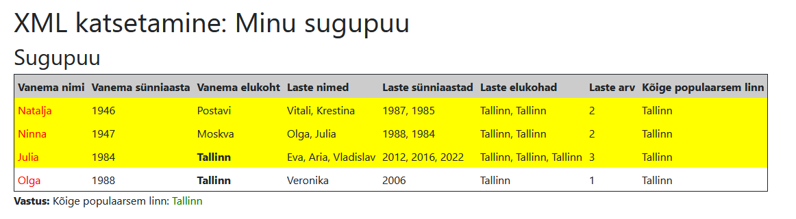

## Tehtud tööd

- Rakendatud tabel, mis kuvab infot vanemate ja laste kohta.
- Lisatud kollane taustriba ridadele, kus on kaks või enam last.
- Arvutatud kõige populaarsem elukoht ja selle esiletõstmine tabelis.
- Vanemate sorteerimine sünniaasta järgi kasvavas järjekorras.
- Nime välja punane värv, kui nimel on täht "a".

 

